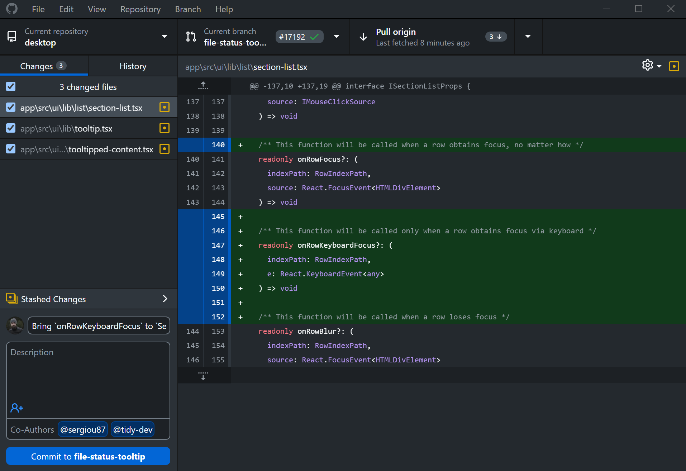

# TMA4320: Git-øvelse før prosjekt

Denne øvingen er ment som en intro til Git og GitHub. Du lærer grunnleggende kommandoer ved å gjøre enkle endringer i dette repoet.

## Verifiser at Git er installert
Åpne terminalen og kjør:
```bash
git --version
```
Dersom Git er installert, vil du se noe som `git version 2.x.x`. 

## Del 1: Sette opp repoet lokalt

### Fork dette repoet
1. Pass på at du er logget inn på GitHub
2. Trykk på "Fork"-knappen øverst til høyre på denne GitHub-siden (se bildet under).
3. Velg "Copy `main` branch only".
4. Du får nå din egen kopi av repoet.
5. Velg om du vil gjøre repoet privat eller offentlig (valgfritt). Dersom det er et offentlig repo, kan alle se koden din.


### Naviger til passende sted på maskinen din
Åpne terminalen og gå til mappen der du vil ha repoet. Bruk kommandoene under for å se hvor du befinner deg
```bash
pwd                     # Sjekk hvilken mappe du nå er i
ls                      # List filer og mapper i den nåværende mappen
```
og bruk `cd` for å navigere til ønsket mappe, for eksempel:
```bash
cd Documents/Skole     # Gå til mappen "Skole" inne i "Documents"
cd ..                  # Gå ett nivå opp i mappestrukturen (dette tar deg til "Documents")
```

### Klon repoet til maskinen din
```bash
git clone https://github.com/DITT-BRUKERNAVN/TMA4320_Git_Oving.git  # Bytt ut DITT-BRUKERNAVN med ditt GitHub-brukernavn
cd TMA4320_Git_Oving                                                # Beveg deg inn i mappen
```

### Sjekk statusen
```bash
git status 
```
Dette viser hvilken branch du er på og om det er noen endringer. Ettersom du nettopp har klonet repoet, skal det ikke være noen endringer, og gir dermed en output
```
On branch main
Your branch is up to date with 'origin/main'.

nothing to commit, working tree clean
```


## Del 2: Gjør din første endring

### Oppgave: Legg til navnet ditt i `studenter.txt`

1. Åpne filen `studenter.txt` i en teksteditor
2. Legg til navnet ditt på en ny linje
3. Lagre filen

### Sjekk hva som er endret
```bash
git status
git diff
```

### Legg til endringen og commit
```bash
# Legg til filen til staging area
git add studenter.txt

# Commit alle endringer som er i staging area
# `-m` flagget lar deg legge til en commit-melding direkte i kommandoen
git commit -m "La til mitt navn i studentlisten"
```

### Push til GitHub
For å sende endringen til GitHub, bruk
```bash
git push -u origin main
```
Gå til GitHub og sjekk at endringen dukket opp i !

## Del 3: Jobbe med branches

Branches lar deg jobbe på nye features uten å ødelegge hovedkoden.

### Lag en ny branch
```bash
git branch min-feature      # Lag en ny branch kalt "min-feature"
git switch min-feature      # Bytt fra "main" branch til den nye branchen
```

### Oppgave: Bruk din teksteditor og gjør noen endringer i `kalkulator.py`

For eksempel, legg til en ny funksjon:
```python
def multipliser(a, b):
    return a * b
```


### Sjekk hva som er endret
```bash
git status 
git diff
```

### Commit endringene
```bash
git add kalkulator.py
git commit -m "La til multiplikasjonsfunksjon"
```

### Merge branchen tilbake til main (lokalt)
Nå som du har gjort endringer på `min-feature`-branchen, kan du merge den tilbake til `main`:
```bash
git switch main                 # Bytt tilbake til main-branchen
git merge min-feature           # Merge inn endringene fra min-feature
git push                        # Push endringene til GitHub
```
Du har nå laget en branch, gjort endringer, og merget dem tilbake til main. Bruk `git log` for å se commit-historikken, og press `q` for å gå ut av log-visningen`

### Viktig!: Merge-conflicts

Merge conflicts oppstår når to branches endrer samme linje i en fil. Når vi skal merge disse branchene vil Git ikke vite hvilken endring som skal beholdes, og du må løse konflikten manuelt. Dette er en vanlig situasjon når flere personer jobber på samme prosjekt, og kan virke skremmende i starten. 

Jeg anbefaler å bruke 5 minutter etter forelesning på å se denne videoen. Deretter kan du prøve å lage en merge-conflict self, og håndtere den slik som forklart.

https://www.youtube.com/watch?v=DloR0BOGNU0

## Del 4: Push branches og Pull Requests på GitHub

Nå som du har lært å jobbe med branches lokalt, skal vi se hvordan du bruke egne branches på GitHub. Dette kan være nytting når dere skal samarbeide i prosjektet.

### Push en branch til GitHub
La oss først lage en ny branch med noen endringer som vi kan pushe:
```bash
git branch github-test          # Lag en ny branch
git switch github-test          # Bytt til den nye branchen
```

Gjør en liten endring i `kalkulator.py` (f.eks. legg til en kommentar eller en ny funksjon), og commit:
```bash
git add kalkulator.py
git commit -m "Test av GitHub branch"
```

Push branchen til GitHub:
```bash
git push -u origin github-test
```
Flagget `-u` (eller `--set-upstream`) kobler din lokale branch til en remote branch på GitHub, slik at fremtidige `git push` og `git pull` vet hvor de skal sende/hente data. `origin` er standardnavnet for remote-repoet du klonet fra (dvs. ditt forkede repo på GitHub), og `github-test` er navnet på branchen du pusher.

### Lag en Pull Request til din egen main-branch
En Pull Request (PR) er en forespørsel om å merge endringer fra én branch til en annen. På GitHub:

1. Gå til ditt forkede repo på GitHub
2. Du vil se en notifikasjon: "github-test had recent pushes" med en knapp "Compare & pull request"
3. Trykk på "Compare & pull request"
4. Sjekk at:
   - **base repository** er ditt eget repo (ikke originalen!)
   - **base** er `main`
   - **compare** er `github-test`
5. Skriv en kort beskrivelse av endringene
6. Trykk "Create pull request"
7. Trykk "Merge pull request" og deretter "Confirm merge"

Du har nå merget en branch via en Pull Request i ditt eget repo. På denne måten kan flere gruppemedlemmer jobbe på egne branches og sende Pull Requests til main-branchen når de er ferdige.

### Tilbake i terminalen:
```bash
git switch main     # Bytt tilbake til main-branchen
git pull            # Hent endringene fra GitHub (inkludert mergen du nettopp gjorde)
```

### Lag en Pull Request til det originale repoet
Dersom du har gjort forbedringer som du vil dele med det originale repoet (det du forket fra), kan du lage en Pull Request dit:

1. Gå til det **originale** repoet på GitHub (ikke din fork)
2. Trykk på "Pull requests" i menyen
3. Trykk "New pull request"
4. Trykk på "compare across forks"
5. Velg:
   - **base repository**: det originale repoet
   - **base**: `main`
   - **head repository**: ditt forkede repo
   - **compare**: branchen med dine endringer
6. Trykk "Create pull request"
7. Skriv en beskrivelse av hva du har endret og hvorfor

Nå må eieren av det originale repoet godkjenne og merge din Pull Request. Dette er slik open source-prosjekter fungerer!

## Del 5: Bruk av .gitignore

Noen filer skal ikke være med i Git, for eksempel store datafiler, midlertidige filer, eller autogenererte filer. Filen `.gitignore` forteller Git hvilke filer og mapper som skal ignoreres.

1. Last ned [dette bildet](https://backends.it.ntnu.no/user-profile-service/rest/files/37db5b57-f824-3b92-bfb3-c4f6e4d543ab) (https://backends.it.ntnu.no/user-profile-service/rest/files/37db5b57-f824-3b92-bfb3-c4f6e4d543ab) til repo-mappen, og lagre det som `brynjulf.png`.

2. Sjekk status:
```bash
git status
```
Du vil se at den nye fila `brynjulf.png` er "untracked". Dette betyr at Git legger merke til at fila er lagt til, men den er ikke med i noen commit enda. Dersom vi vet at vi aldri vil ha denne fila med i Git, kan vi bruke `.gitignore` for å fortelle Git å ignorere den.

3. Åpne `.gitignore` fila i en teksteditor og legg til:
```bash
brynjulf.png
```

5. Sjekk status igjen:
```bash
git status
```
Nå vil du se at `brynjulf.png` ikke lenger vises som en untracked fil!

### Nyttige .gitignore patterns:
- `*.pdf` - ignorerer alle PDF-filer
- `mappenavn/` - ignorerer hele mappen "mappenavn"
- `temp*` - ignorerer alle filer som starter med "temp"

6. Commit .gitignore filen:
```bash
git add .gitignore
git commit -m "Oppdaterte .gitignore"
```

**Tips:** GitHub har en samling av nyttige .gitignore-templates for ulike språk: [github.com/github/gitignore](https://github.com/github/gitignore) 

**Obs:** `.gitignore` påvirker kun filer som ikke allerede er tracket av Git. Hvis du allerede har commitet en fil, må du fjerne den fra Git-historikken for at `.gitignore` skal fungere på den filen.

## Oppsummering av brukte kommandoer

```bash
# Sjekke status og endringer
git status                      # Se hva som er endret
git log                         # Se commit-historikk
git diff                        # Se hva som er endret i filer

# Legge til og committe endringer
git add <filnavn>               # Legg til en fil for commit. Evt. bruk "git add ." for å legge til alle endrede filer.
git commit -m "Commit melding"  # Lag en commit med en melding


# Jobbe med branches
git branch                      # Se alle branches
git branch <branch-navn>        # Lag en ny branch
git switch <branch-navn>        # Bytt til en annen branch
git merge <branch-navn>         # Merge en branch inn i den nåværende branchen

# Sende endringer til og fra GitHub
git push                        # Send endringer til GitHub
git pull                        # Hent nyeste endringer fra GitHub
```
**Merk:** Dette er bare et utvalg av de mest brukte kommandoene. Git har mange flere funksjoner og kommandoer som kan være nyttige i forskjellige situasjoner.

## Tips

- Pull før du begynner å jobbe (for å få andres endringer)
- Test koden din før du pusher
- Bruk branches for nye features
- "Atomic commits": Gjør små, meningsfulle commits. Ikke commit store endringer på en gang.

Andre nyttige ressurser:
- [Git Cheat Sheet](https://education.github.com/git-cheat-sheet-education.pdf)
- [Pro Git Book](https://git-scm.com/book)
- [Philomatics Youtube kanal](https://www.youtube.com/@philomatics)

## Bonus: GUIs for Git
Mange foretrekker å bruke grafiske brukergrensesnitt (GUIs) for å håndtere Git i stedet for kommandolinjen. Dette kan gjøre det enklere å visualisere endringer og raskere å utføre visse operasjoner. Her er noen populære alternativer.

### LazyGit (min personlige favoritt)
LazyGit er en terminal-basert GUI. Personlig bruker jeg LazyGit for 90% av mine Git-operasjoner, og kun kommandolinen for avanserte ting. Koden er åpen kildekode og programmet kan lastes ned fra [LazyGit GitHub repository](https://github.com/jesseduffield/lazygit).


### GitHub Desktop
GitHub Desktop er et brukervennlig GUI for Git som er utviklet av Microsoft. Det kan lastes ned gratis fra [GitHub Desktop](https://desktop.github.com/download/).



### Source Control i VSCode
VSCode har innebygd støtte for Git gjennom Source Control-panelet. Finn mer informasjon på [Source Control in VS Code](https://code.visualstudio.com/docs/sourcecontrol/overview).


## Bonus 2: SSH-nøkkel for GitHub 

I denne øvelsen bruker vi HTTPS for å kommunisere med GitHub, noe som fungerer fint. Dersom du vil slippe å skrive brukernavn og passord hver gang du pusher, kan du sette opp en SSH-nøkkel.

[Følg denne guiden for å lage en SSH-nøkkel og koble den til GitHub](https://docs.github.com/en/authentication/connecting-to-github-with-ssh/generating-a-new-ssh-key-and-adding-it-to-the-ssh-agent)

**Merk:** Dette kan være litt krevende å sette opp, personlig spør jeg som regel AI om hjelp til dette.

